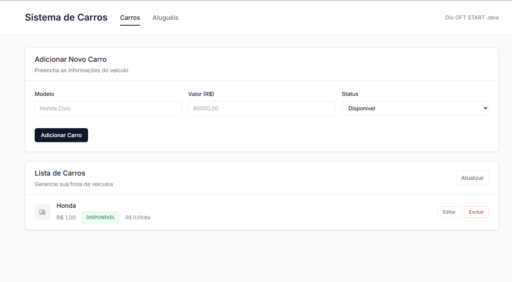
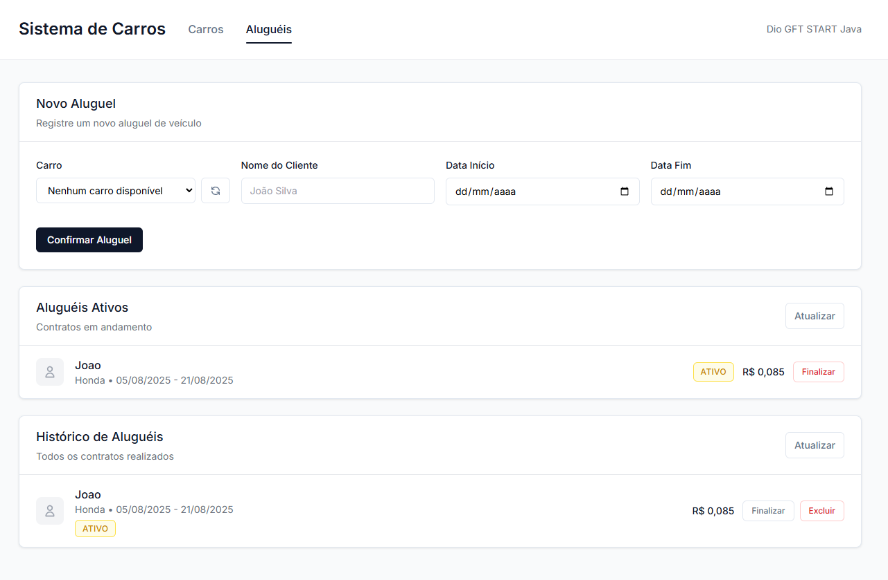

# Sistema de Locadora de Carros - Spring Boot


Sistema RESTful em Spring Boot para gerenciar aluguel de carros com interface web moderna e API REST completa.

## 📋
<details>
<summary><strong>Sobre o Sistema</strong></summary>

### O que faz
- Cadastra veículos com modelo, valor e disponibilidade
- Controla aluguéis com cálculo automático de valores
- Interface web moderna + API REST

### Regras Básicas

**Carros:**
- Status: "Disponível" ou "Indisponível"
- Valor da diária = 0,5% do valor do carro
- Exemplo: Carro R$ 100.000 → Diária R$ 500

**Aluguéis:**
- Mínimo 1 dia
- Data início ≥ hoje, data fim > data início  
- Valor total = (Dias + 1) × Valor diária
- Carro fica indisponível quando alugado

### Tecnologias
- Java 21 + Spring Boot 3.5.4
- Banco H2 (em memória)
- Frontend: HTML + Tailwind CSS + JavaScript
- Arquitetura: MVC + Repository Pattern

</details>

<details>
<summary><strong>Como Iniciar</strong></summary>

### Pré-requisitos
- Java 21+ instalado
- Git

### Execução
```bash
# 1. Clonar projeto
git clone https://github.com/helxysa/aluguel-carro-java.git
cd aluguel-carro-java

# 2. Executar
./mvnw spring-boot:run     # Linux/Mac
# ou
mvnw.cmd spring-boot:run   # Windows
```

### Acessar
- **Interface Web**: http://localhost:8080/
- **API**: http://localhost:8080/api/carros
- **Documentação (Swagger)**: http://localhost:8080/swagger-ui.html

### Fluxo de Teste
1. Acesse a interface web
2. Cadastre alguns carros na aba "Carros"
3. Crie aluguéis na aba "Aluguéis" 
4. Veja os cálculos automáticos
5. Finalize aluguéis para liberar carros

### Banco de Dados (H2)
- URL: `jdbc:h2:mem:testdb`
- Usuário: `sa`
- Senha: (vazia)

</details>

<details>
<summary><strong>🖥️ Interface do Sistema</strong></summary>

### Tela de Carros


### Tela de Aluguéis


</details>

<details>
<summary><strong>🔗 API Endpoints</strong></summary>

### Carros (`/api/carros`)
- `GET /carros` - Listar todos
- `POST /carros` - Criar carro
- `PUT /carros/{id}` - Atualizar
- `DELETE /carros/{id}` - Remover

### Aluguéis (`/api/alugueis`)
- `GET /alugueis` - Listar todos
- `GET /alugueis/ativos` - Apenas ativos
- `POST /alugueis/alugar` - Criar aluguel
- `PUT /alugueis/finalizar/{id}` - Finalizar
- `GET /alugueis/disponibilidade/{carroId}` - Verificar disponibilidade

</details>

<details>
<summary><strong>⚙️ Comandos Úteis</strong></summary>

```bash
# Compilar apenas
./mvnw compile

# Executar testes
./mvnw test

# Gerar JAR
./mvnw package

# Limpar build
./mvnw clean
```

### Estrutura do Projeto
```
demo/
├── src/main/java/projeto/demo/
│   ├── model/          # Entidades (Carro, Aluguel)
│   ├── repository/     # Acesso aos dados
│   ├── service/        # Lógica de negócio
│   └── controller/     # API REST
├── src/main/resources/
│   ├── static/         # Frontend
│   └── application.properties
└── pom.xml            # Dependências Maven
```

</details>

---

<div align="center">
  <a href="https://github.com/helxysa/aluguel-carro-java">🔗 Repositório no GitHub</a>
</div>